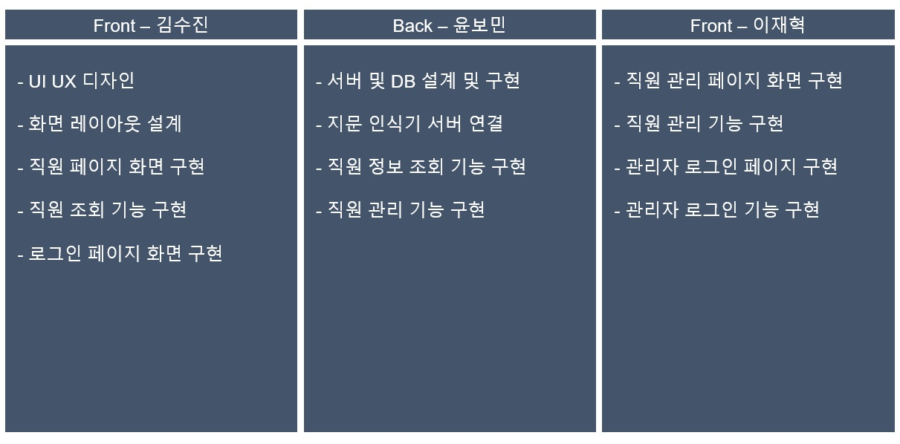
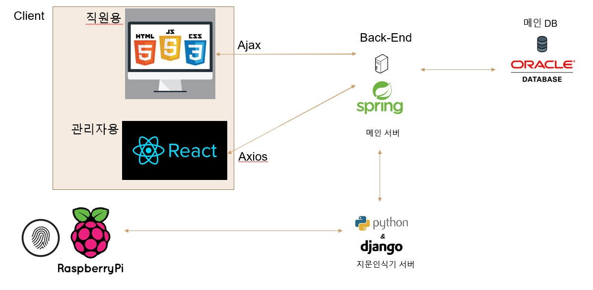

# HELLO-EMPLOYEE

## 90Factory Team Project

### 개발 기간

2020.03.23 ~ 2020.04.24

### 주제

직원관리 시스템

- 실시간 직원조회
- 지문 인식 출퇴근
- 편리한 직원관리

### 인원 (총 3인)

### 아키텍처

### `Admin Page`

Admin Page 의 상세 내용은
(https://github.com/jhlee225/hello-employee-admin)
에서도 확인 하실 수 있습니다.
